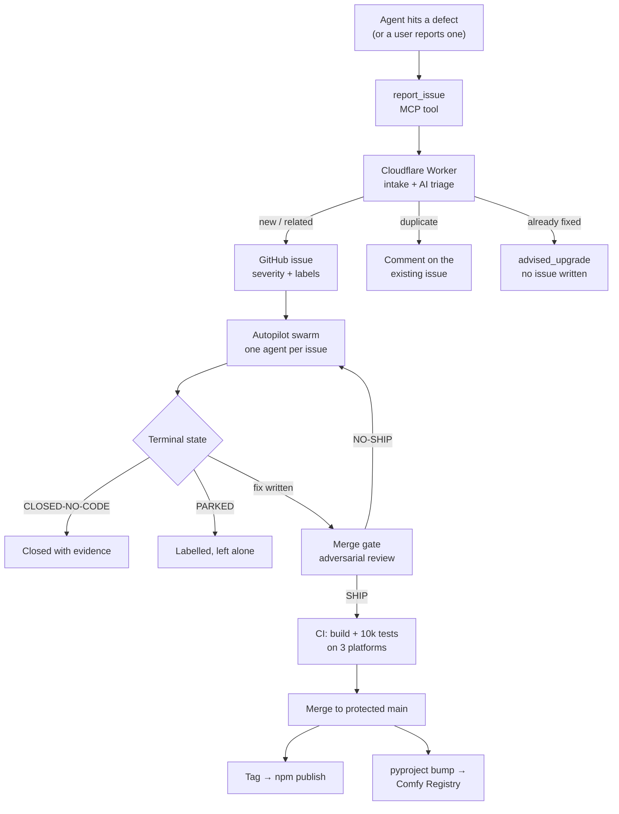
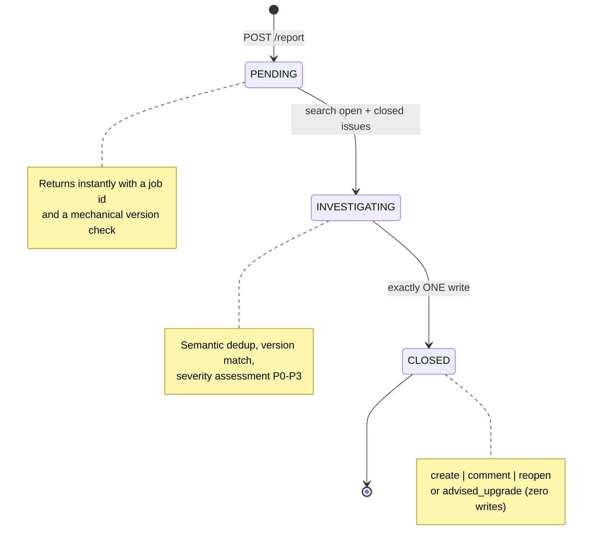
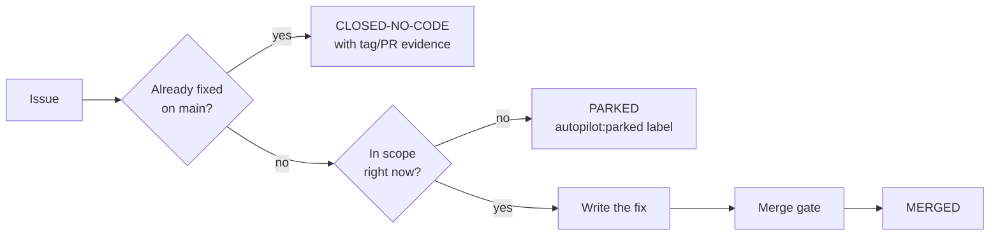
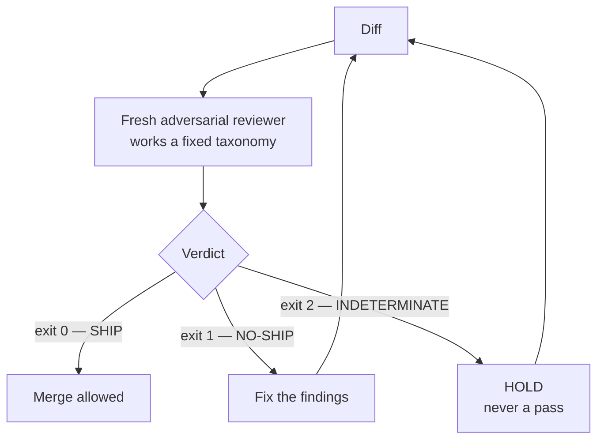
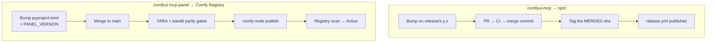

_by [artokun](https://github.com/artokun) · August 19, 2026 · autopilot · Cloudflare · agents_

Most of the fixes in [comfyui-mcp](https://github.com/artokun/comfyui-mcp) are filed, triaged,
written, reviewed, tested and released without anyone opening a text editor. Not because the
agents are trusted — precisely because they aren't. Every stage in this pipeline exists to catch
the stage before it.

Here's the whole thing, then each piece in detail.



## Stage 1 — intake, and the honesty problem

Reports arrive through an MCP tool, `report_issue`, which any agent driving ComfyUI can call. The
governing instruction is **fix-then-file**: when an agent hits a defect in our own code it patches
it locally so the user is unblocked, *then* files the report with the diff attached. Reports arrive
as near-PRs rather than tickets.

The bias is deliberately toward over-reporting. You do not need to be blocked, and it does not need
to be fatal — a workaround you had to invent is itself the signal. Server-side dedup makes a
duplicate a no-op, so under-reporting is the expensive failure mode.

Two things in a report are not written by the reporting model, because a model is a poor witness
about itself:

- **Versions** are read from the running process, not asked for. The version named first is the one
  *executing*, which is not always the one installed on disk — an upgrade that lands while the
  orchestrator is up would otherwise pin every issue to code nobody ran.
- **Which model is filing** is stamped by the orchestrator from the panel's provider/model
  selection. Ask a model to name itself and it guesses; the agent's environment block never carried
  the model at all. So the orchestrator publishes it and the tool reads it back:

```
Filed from the ComfyUI panel by **ollama** · model `gemma3:4b` — stamped by comfyui-mcp
from the panel's provider/model selection, not self-reported.
<!-- reporter-agent: backend=ollama model=gemma3:4b -->
```

That matters more than it sounds. The panel can be driven by a frontier model or a local 4B, and
report quality tracks that choice closely. Without the stamp, a thin report from a small local
model is indistinguishable from a thin report from a large hosted one.

## Stage 2 — the Cloudflare Worker that triages

Intake is a Cloudflare Worker. Each report gets its own Durable Object running an agentic loop
(Agents SDK → GitHub's remote MCP → a reasoning model), so triage is a real investigation rather
than a template.



The submit returns immediately with a job id and a **mechanical** version acknowledgement — a plain
comparison against the latest published versions, computed without the model. The client then polls
until the job closes. The design rules that matter:

- **One write per job.** The agent gets a budget of exactly one create, comment, or reopen. That
  budget is reserved *before* the call executes, so a write whose response is lost still counts.
- **Severity is never caller-supplied.** The triage model assesses P0–P3 and the issue is *born*
  with the label; a caller-supplied `severity:*` label is stripped at intake so a reporter cannot
  spoof a P0.
- **The body is pinned.** A created issue carries the reporter's body verbatim, not the model's
  paraphrase. This is also why the model stamp rides in the body rather than a payload field —
  unknown top-level fields are dropped, but the body always survives.
- **The best outcome writes nothing.** If triage matches the report to an issue already fixed in a
  version newer than the reporter's, it answers with the fixing PR and a recommendation to upgrade.
  No issue is created. The most common real resolution is "you are four versions behind."
- **Idempotency by HMAC.** Every body carries an unforgeable content marker, so a retry after an
  uncertain write adopts the existing issue instead of filing a twin.

## Stage 3 — the swarm

Filed issues are picked up by an autopilot: one agent per issue, each in its own git worktree so
they cannot collide. An agent owns its issue until it reaches a **terminal state**, and there are
only three:



The counter-intuitive rule is the important one: **manufacturing a change for an issue that needs
none is the most damaging thing an agent can do here.** On the last backlog sweep, 28 of 34
closures needed no code at all — the report was against an old version, or described a fix that
already existed. So the first task is always "is this already fixed?", answered with
`git tag --contains` against the reporter's stated version, in *both* repos, because the server and
the panel ship separately.

Terminal states are declared with labels, not prose. A supervisor reads labels; a beautifully
argued comment saying "parked" that lacks the label reads as unfinished work and gets resumed
forever.

## Stage 4 — the gate that says no

No fix merges on its author's own judgement. The diff goes to a **separate model in a fresh
session** that has never seen the implementation, is given only the diff, and is told to refute it.



Three exit codes, and the third is the one that earns its keep: a reviewer that ran out of quota,
died mid-run, or produced empty output is **INDETERMINATE**, which holds the merge. Treating
"couldn't check" as "checked and fine" is the failure this contract exists to prevent.

The reviewer works a fixed taxonomy of defect classes. The most productive by far:

1. **Two states collapse.** A check that cannot distinguish the case you care about from one you
   don't.
2. **A guard comparing the wrong pair.** Present, correct-looking, and asking about the wrong two
   values.
3. **A test that cannot fail.** Green because it manufactures the state production destroys.

That last one is not theoretical. In a single day of work on one feature, three separate tests of
mine were blind by construction — including one that hand-wrote a field into a config file
immediately before calling the function whose own first act is to erase that field. Thirteen
passing tests proved nothing about the bug they were written for.

The gate rounds are not ceremony either. On one small change — a fallback for Windows accounts that
cannot create scheduled tasks — successive rounds found six P1 defects, and two of them were
introduced by the fixes for the previous round's findings. Every one of them would have hit exactly
the users the feature was written for.

## Stage 5 — evidence, not green checks

A passing suite is necessary and nowhere near sufficient. Two habits do the real work:

**Mutation testing at the call site.** Before believing a test protects a fix, break the fix and
confirm the suite goes red. A test that passes with the code deleted is decoration. This regularly
catches wiring that no test actually reaches — the helper is covered, the *call* to it is not.

**Live verification on real hardware.** Unit tests cannot tell you whether a spawned subprocess
actually receives the environment variable you passed it. So the pipeline runs the built artifact:
a real orchestrator on a real bridge port, driven over the real panel protocol, with a real agent
turn. For releases, the *published tarball* is unpacked and grepped for the symbols that were
supposed to ship — verifying the artifact, not the CI run that produced it.

## Stage 6 — release

Two packages ship on two different mechanisms, and both mainlines are protected.



**The tag is the publish trigger**, which produces a trap worth naming: tag the wrong commit and
you publish something nobody reviewed. The rule is to tag the *merged* SHA read back from the
remote — never local `HEAD`, which can carry an uncommitted bump or a conflicted merge. A stale
local tag pointing at an unmerged commit is silent until the day it publishes.

The panel's gates mirror the registry's own scanner rather than guessing at it: bandit with the
registry's exact exclusions and **no severity floor** — a `-ll` filter hides exactly the LOW
findings their scan reports — plus a YARA-parity pass over the shipped archive. Those rules match
call-shaped literals in *prose*, so the changelog is excluded from the package: a file documenting
a removed `subprocess` call trips the same rule as the call did.

## The numbers, and what they actually measure

Here is a month of that pipeline running, as GitHub sees it.


**957 pull requests merged. Zero open. 581 issues closed. Zero new.**

The zeros are the interesting part, and they do *not* mean "no bugs". They mean nothing is sitting
in limbo. That is the terminal-state rule from stage 3 showing up as a statistic: every issue lands
in MERGED, CLOSED-NO-CODE or PARKED, and a swarm that is not allowed to leave things half-finished
produces an empty queue as a side effect. A backlog is what accumulates when work can stop
somewhere other than a terminal state.

Two more from that panel, read carefully:

- **2,829 commits across all branches, but 1,247 on main.** The gap is not lost work. Main
  squash-merges — 130 of its last 200 commits end in `(#N)` — so a PR that took three gate rounds
  arrives as one commit. The branch total is where the rework lives: round two, round three, and
  the fixes for the fixes.
- **406,599 additions against 17,451 deletions**, a 23:1 ratio that would be alarming in a product
  codebase. It mostly isn't product code. The docs ship in **11 translated locales**, and
  translations are **71% of all documentation lines** — so a single docs change lands twelve times.


The weekly commit chart goes from roughly flat to 400-a-week over one summer. That shape is what
this whole post is about — but it is a measure of *activity*, not of value, and it would look
identical if the swarm spent August writing elaborate nonsense. Which is precisely why the gate,
the mutation checks and the live verification exist: they are the part of the system that has an
opinion about whether any of those commits should have happened.

## An honest footnote about our download numbers

npm currently reports about **123,000 weekly downloads**, on a curve that bends up and to the right
in a way that would look excellent on a slide. Before anyone gets excited, here is the mechanism
behind the graph:

- The pipeline published **11 versions on the day this post was written** — and 11 more on a single
  day the week before. There are 327 in total.
- Every install runs a self-updater that checks npm hourly
  (`[self-restart] npx install — checking npm for updates every 60m`). So a release doesn't trickle
  out over a week; the entire fleet pulls it at roughly the same moment.
- A gratifying number of MCP directories, mirrors and aggregators track our version and re-fetch
  whenever it changes, which — see the first bullet — is frequently.

So a healthy slice of that curve is our own release cadence, multiplied by our own auto-updater,
admiring itself in a mirror. The counter is measuring how often the swarm has a productive
afternoon, not how many humans showed up. We're leaving it on the dashboard anyway.

The same discount applies to everything else GitHub reports:


21,890 clones in two weeks from 3,010 unique cloners — and CI runners, mirrors and package
aggregators clone too. 6,281 views from 2,752 unique visitors is the more human-shaped number,
and the referrer table is the genuinely interesting one:


Search, then GitHub itself, then **chatgpt.com** ahead of Bing, Brave, DuckDuckGo and Reddit.
People are asking a model how to drive ComfyUI with an agent and arriving here on its
recommendation. For a project whose entire premise is agents using tools, being *discovered* by an
agent is a pleasing kind of circular.

## The numbers I don't have

Every figure above is collected by someone else — GitHub, npm — because the software itself
collects nothing. There is no Google Analytics on the docs, no telemetry in the panel, no
phone-home in the MCP server. Not one analytics SDK in either repository.

That is a deliberate choice, and an ambivalent one. I would genuinely like to know which panel
features get used and where people give up. But doing that properly under GDPR is real work for a
project this size, doing it improperly is worse than not doing it, and — honestly — the curiosity
isn't strong enough to outweigh either. So the instrumentation stays out.

Which is the actual reason this section is full of caveats. When you refuse to measure your users,
the only numbers left are proxies someone else happened to collect for a different purpose. Bad
proxies, cheerfully reported, beat good telemetry nobody consented to.

## Distribution is king

Three times now, someone has offered to pay to put an advertisement or their product inside the
panel. There are no ads in the panel, and there won't be.

But the offers say something the graphs don't. Nobody made those offers because of the code
quality, the test count, or the gate rounds this post spends most of its length on. They made them
because the thing is *installed* — sitting in a sidebar, opening every time someone launches
ComfyUI. Distribution is the asset. Everything upstream of it — the triage worker, the swarm, the
adversarial review — exists to make sure that what gets distributed, at eleven releases a day into
an auto-updating fleet, is worth having there.

That cuts both ways, and it is the strongest argument for the paranoia. A pipeline this fast with a
weaker gate would not be an achievement; it would be a very efficient way to push a bug to every
install on the same afternoon.

## Why an independent project builds this at all

comfyui-mcp shipped its first npm version on **15 February 2026**. The official `comfy-mcp` package
was first published on **31 July 2026** — five and a half months later. You can check both with
`npm view <package> time.created`; I'd rather cite something verifiable than claim a head start.

That gap is the whole context for this post. An independent project that arrives first does not get
to compete on domain authority, a marketing budget, or a place in the official docs. There has been
no ad spend here — not as a strategy, just as a fact; the traffic in the section above is search
results, GitHub, and people telling each other. That advantage is not durable and I don't pretend
otherwise: authority accrues to whoever owns the domain, eventually.

What an independent project *can* compete on is the thing this whole post describes. Nobody with a
larger budget is going to out-care you about whether a Windows account with a locked-down Task
Scheduler can start a background process. The pipeline is the answer to being outgunned everywhere
else: if the fix for the bug you filed can be triaged, written, adversarially reviewed, verified on
real hardware and published while you are still reading the issue thread, that is a form of
competition that headcount doesn't straightforwardly beat.

None of this is paid work. It exists because people use it and it helps them, and because a bug
report answered by a shipped release the same day is a genuinely satisfying thing to build. The
metrics section above is careful about what it can and cannot claim. This part isn't a metric at
all — it's just the reason the rest of it gets maintained.

## What this does not do

It does not remove judgement; it relocates it. A human still decides what is in scope, what is
parked, and when a "fix" is really a product decision. The pipeline's job is narrower: make sure
nothing is silently dropped, nothing merges unreviewed, and nothing ships unverified.

And it fails in instructive ways. The same day this post describes, a fix merged while its gate was
still running — landing three P1s in a published release that the gate had already found. The
pipeline was right; the sequencing wasn't. The gate is only a gate if you wait for it.
